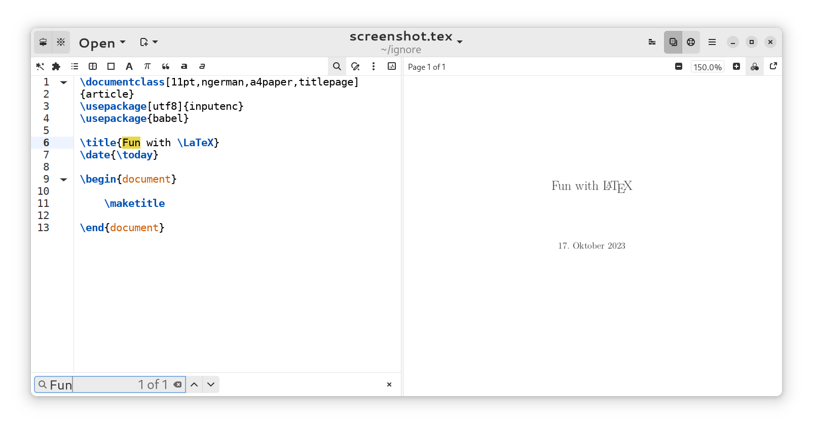

# Chisel

Simple yet full-featured LaTeX editor for the GNOME desktop, written in Python with GTK.

Chisel is a fork of [Setzer](https://www.cvfosammmm.org/setzer/) with a modern Libadwaita coat of paint!

## Running Chisel with Gnome Builder

To run Chisel with Gnome Builder just click the "Clone.." button on the start screen, paste in the url (https://github.com/kinten108101/Chisel.git), click on "Clone" again, wait for it to download and hit the play button. It will build Setzer and its dependencies and then launch it.

Warning: Building Setzer this way may take a long time (~ 30 minutes on my laptop).

## Building your documents from within the app

To build your documents from within the app you have to install a LaTeX interpreter. For example if you want to build with XeLaTeX, on Debian this can be installed like so:
`apt-get install texlive-xetex`

To specify a build command open the "Preferences" dialog and choose the command you want to use under "LaTeX Interpreter".

## Getting in touch

Chisel development / discussion takes place on GitHub at [https://github.com/kinten108101/Chisel](https://github.com/kinten108101/setzer "project url").

Setzer development / discussion takes place on GitHub at [https://github.com/cvfosammmm/setzer](https://github.com/cvfosammmm/setzer "project url").

## Acknowledgements

Chisel is a fork of Setzer. Most functionalities are borrowed from the master branch of Setzer, while all UI elements are changed to make the app fit in the modern GNOME desktop ecosystem.

## License

Chisel is licensed under GPL version 3 or later. See the COPYING file for details.
